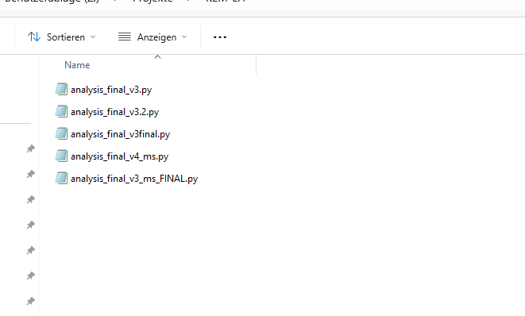

# Good Coding in Social Science
#### KEM Learning Hour 
April 28, 2026
Maria Sirvent 

---

## Does this look familiar?


*(The "analysis_final_v3_ms_FINAL_nowREALLY.py" trap)*

---

## Why Code Quality Matters

- **Productivity**: Spend your energy on **science**, not debugging.
- **Scalability:** Keep control as the project grows more complex.
- **Scientific Integrity:** Be confident that the code does exactly what you claim.
- **Future-Proofing** Work seamlessly with colleagues and your future self.

> Your most important collaborator is yourself from 6 months ago. 
> But she doesn't answer e-mails.

---

## Small Habits, Big Impact

Your "future you" will thank you! We'll focus on three key pillars of good code:

- **Code and Repository Architecture**: Organize your project well.
- **Version control**: Build a time machine for your work.
- **Defensive Coding**: Make your scripts break-proof and sanity-checked.

---

## Structure: Part I (A Groomed Folder Tree)

Don't mix data with logic. Keep your workspace clean.

```text
project-root/         <-- @IAB: "P1234"
├── data/             <-- @IAB: "Analysedatenverzeichnis"
│   ├── raw/          <-- NEVER touch these. Read only.
│   └── processed/    <-- Generated by code
|── src/              <-- The Engine: Put all re-usable functions here
├── scripts/          <-- The Driver: Numbered (01_clean.R, 02_plot.R)
├── output/           <-- Tables and Figures
├── config.json       <-- This is optional but very helpful
└── README.md         <-- The manual for your colleagues
```

---

## Structure: Part II (Spotting Spaghetti)

Can you spot the problems in this script?
```R
# Analysis_Final_v2_COPY.R (Vague name)
data <- read.csv("survey_data_new.csv")
d2 <- data[data$q1 != 99, ] # Magic numbers (99?) and cryptic columns (q1?)
d2$var_x <- d2$income / 12

# Manual intervention: This is a reproducibility disaster!
d2$var_x[14] <- 4500 

d3 <- d2[d2$age > 18, ] # Ad-hoc filtering
# Source("other_script.R") # Dangerous: Changes 'd3' behind the scenes!
```

---

## The Features of Clean Code
- Intentional Naming: ``monthly income`` instead of ``var_1_alt``.
- Hands-Free Pipelines: No manual data edits. Ever.
- Relative Paths: Use ``./data/`` so the code runs on any computer.
- Narrative Comments: Explain why you made a choice, not how R works.
- Separation of Concerns: Keep cleaning scripts separate from analysis scripts and logic separate from data.

> Code should be readable like a story.

---

## Example: Modular and Readable
```python
# file: src/logic.py
def calculate_age(birth_year, current_year=2026): 
    return current_year - birth_year

# file: scripts/01_analysis.py
from src.logic import calculate_age
import pandas as pd

RAW_DATA = "./data/raw/survey_responses.csv" 

# Loading into a clearly named DataFrame
survey_data = pd.read_csv(RAW_DATA) 

# Transformation is explicit and readable
survey_data["age"] = calculate_age(survey_data["birth_year"])
```

---

## The Control Panel ``config.json``
Stop hard-coding "magic numbers" and local paths in your scripts. Centralize them in a configuration file.

**The `config.json` file:**
```json
{
  "paths": {
    "raw_data": "data/raw/survey_2026.csv",
    "output_dir": "results/tables/"
  },
  "params": {
    "min_age": 18,
    "income_cutoff": 5000,
    "exclude_missing": true
  }
}
```

---

## Why use a Config?
- **Portability**: Your colleage can run your scripts without going through 500 lines to change a file path.
- **Sensitivity Analysis**: When a reviewer asks "what if the age cutoff were 21 instead of 18?", you change a single number in ``config.json``and re-run.

Implementation (R):
```R
conf <- jsonlite::fromJSON("config.json")
df_clean <- df %>% filter(age >= conf$params$min_age)
```
---

## Automation ?

---

## Version Control: Your Time-Machine
Never create multiple versions of the same file. Maintain a **single source of truth**.

```bash
cd path/to/your/project
git init
git add my_analysis.R
git commit -m "Add age filter to respondents under age limit"
```
- See exactly when and why a calculation changed.
- Revert to any previous shapshot if things break.
- Merge changes from co-authors without "final_v3_ms"-confusion.
---

## Testing
- Check for N/As
- Verify row counts after joins
- What is a unit test?
- What kinds of tests are there?
- How does a unit test look?

---

## Summary: Spaghetti Code vs. Modular Machine
| Feature | Spaghetti Code Repo | Modular Machine |
| :--- | :--- | :--- |
| **Data** | Manually edited/multiple copies | Immutable `data/raw/` files |
| **Constants** | Scattered "Magic Numbers" in the script | Centralized `config.json` |
| **Changes** | Manual, hard-coded overrides | Scripted, logged transforms |
| **Testing** | Must run the whole mess and pray | Testable, small functions |

---


## Quick Hacks for Existing Repos
Four simple tricks to stabilize a messy project today:

1. **Lock raw data away**: Create a folder named `data/raw/`. Move your original data there and **never** save over it again. 
2. **Go absolute-path hunting**: Search your scripts for `C:/Users/`. Replace them with relative paths (e.g., `./data/`) so the code works on your colleague's machine.
3. **Eliminate hard-coded numbers**: Find "Magic Numbers" (like `0.82` or `18`). Replace them with a named variable at the top of your script (e.g., `MIN_AGE = 18`).
4. **The README challenge**: Spend 10 minutes writing a `README.md`. Honestly document which scripts work, which are broken, and which order to run them in.

---

## 🏁 Final Takeaways

- **Invest early**: 10 minutes of clean coding today saves 10 hours of debugging pain tomorrow.
- **Version Control is not optional**: Git is your safety net.
- **Separation of Concerns**: Keep your data, your settings and your logic in their own lanes.

---

### Additional Sources

