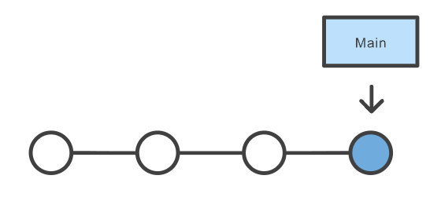
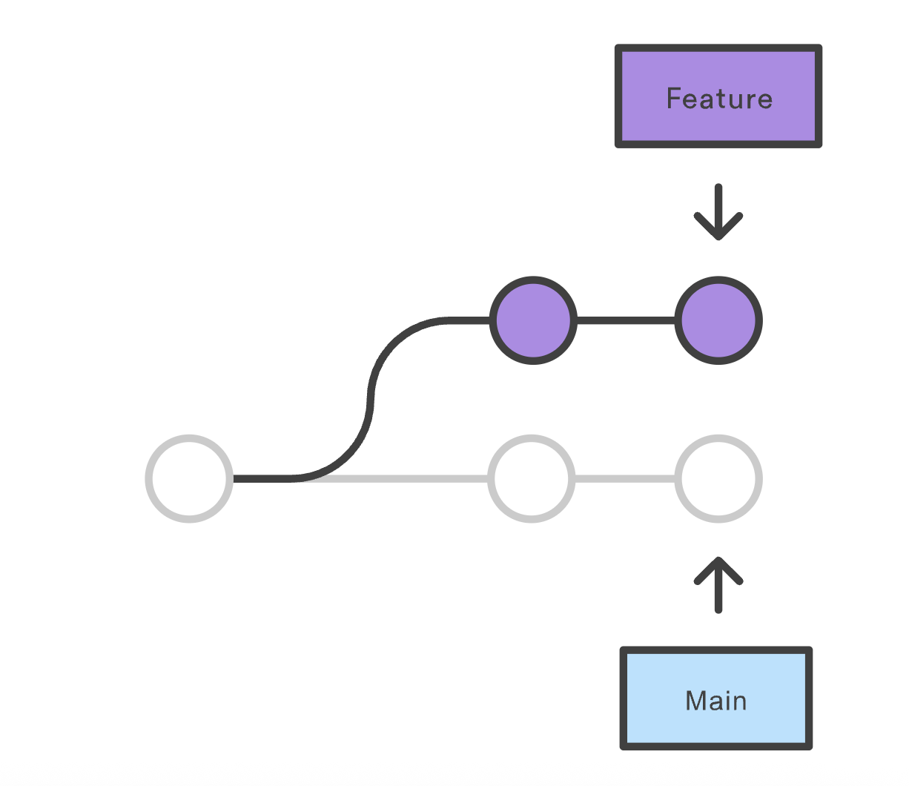

# 🍝
# From Spaghetti Code to Robust Repositories
## Key Practices for Better Coding 
#### KEM Learning Hour 
April 28, 2026
Maria Sirvent 

---

## Why Code Quality Matters

* **Productivity**: Spend your energy on research, not debugging.
* **Scalability:** Keep control as the project grows more complex.
* **Scientific Integrity:** Be confident that the code does exactly what you claim.
* **Future-Proofing:** Collaborate with colleagues and "future you".

---

## Today's agenda

A selection of small habits with big impact on your projects:

- **Structure**: Set up a clean architecture 
  - [Folder tree](#structure-part-i-a-groomed-folder-tree)
  - [Config file](#the-control-panel-configjson)
  - [Readable code](#structure-part-ii-spotting-spaghetti)
- **Version control**: Build a time machine for your work
  - [Using git](#version-control-your-time-machine)
- **Testing**: Catch errors early and build in data sanity checks
  - [Basic tests and data checks](#testing)

*Special thanks to Luca Kogelheide for R examples and additional resources!*

---

# Structure

---

## Structure: Part I - A Groomed Folder Tree

Fundamental principle: **Separation of Concerns**

```text
project-root/         
├── data/             
│   ├── raw/          <-- Read-only
│   └── processed/    <-- Data generated by code
├── src/              <-- Put re-usable functions here
│   ├── data_cleaning.py    
│   ├── feature_construction.py
│   ├── model_training.py
│   └── ...
├── scripts/          <-- Put (numbered) scripts here 
├── output/           <-- Your scripts save tables and figures here
├── main.py           <-- Single point of entry
├── config.json       
└── README.md         
```

---
## Structure: Part II - Spotting Spaghetti
```python
import pandas as pd
d = pd.read_csv("./data/raw/survey_responses.csv") 
d["a1"] = 2026 - d["birth_year"] 

d["income"] = d["income"] / 12

print(d["var1"].mean())
d.to_csv("./data/raw/survey_responses.csv")
```

---
## The Cleanup (Functional Logic)
```python
# file: src/transformations.py
def calc_age(birth_year, current_year): 
    return current_year - birth_year

def calc_monthly_income(income): 
    return income / 12
```
---
## The Cleanup (Script)
```python
# file: scripts/01_analysis.py
from src.transformations import calc_age, calc_monthly_income
import pandas as pd

RAW_PATH = "./data/raw/survey_responses.csv" # or move this to config
OUT_PATH = "./data/processed/survey_responses.csv"
REFERENCE_YEAR = 2026

# Loading into a clearly named DataFrame
survey_data = pd.read_csv(RAW_PATH) 

# Transformation is explicit and readable
survey_data["age"] = calc_age(survey_data["birth_year"], CURRENT_YEAR)
survey_data["monthly_income"] = calc_monthly_income(survey_data["income"])

# Save as separate data set
survey_data.to_csv(OUT_PATH)
```

---
## R Spaghetti
```R
# file: Analysis_Final_REALLY_FINAL.R
d <- read.csv("./data/raw/survey_responses.csv")

# Vague naming and hardcoded logic
d$var1 <- 2026 - d$birth_year

# Overwriting the original column
# If you run this line twice, you've divided by 144!
d$income <- d$income / 12

print(mean(d$var1, na.rm = TRUE))

# Overwriting the source file
write.csv(d, "./data/raw/survey_responses.csv", row.names = FALSE)
```
---
## R Cleanup
```R
source("./src/transformations.R")

# Configuration concern
RAW_PATH <- "./data/raw/survey_responses.csv"
OUT_PATH <- "./data/processed/survey_responses.csv"
REF_YEAR <- 2026

# Execution concern
survey_data <- read.csv(RAW_PATH)

# Indiviudal variable transformation concerns
survey_data$age <- calc_age(survey_data$birth_year, REF_YEAR)
survey_data$monthly_income <- calc_monthly_income(survey_data$income)

# Save to a new location to preserve the "raw" concern
write.csv(survey_data, OUT_PATH, row.names = FALSE)
```
---

## Features of Clean Code
- **Separation of Concerns**: Keep cleaning scripts separate from analysis scripts and functions separate from data.
- **Intentional Naming**: ``age`` instead of ``a1``.
- **Hands-Free Pipelines**: Avoid the need to manually edit a script and implement a single entry point for your program.
- **Relative Paths**: Use ``./data/`` (adapted to your project structure) so the code runs on any computer.
- **Narrative Comments**: Explain *why* you made a choice, not what the code does.

---
## The Control Panel ``config.json``
Keep local paths and parameter values centralized in a configuration file.

**The `config.json` file:**
```json
{"paths": {
    "raw_data": "data/raw/survey_responses.csv",
    "output_dir": "results/tables/"
  },
  "params": {
    "reference_year": 2026,
    "min_age": 18,
    "income_cutoff": 5000,
    "exclude_missing": true
  }
}
```
*Instead of JSON, you could use .csv, .txt or a native data structure (e.g., a named list)*

---

## Why use a Config?
* **Overview**: You see all your paths and parameters neatly structured in one place.
* **Portability**: Your colleague can run your scripts without going through 500 lines to change a file path or the reference year.
* **Sensitivity Analysis**: When you want to try out what happens if you move the age cutoff form ``18``to ``21``, you change a single number in ``config.json``and re-run.

---

## Config Implementation
In Python:
```python
import json
with open("config.json") as f:
  cfg = json.load(f)

df_clean = df[df["age"] >= cfg["params"]["min_age"]]
```
In R:
```R
library(jsonlite)
conf <- fromJSON("config.json")

df_clean <- df[df$age >= conf$params$min_age, ]
```

---

# Version Control

---

## Version Control: Your Time-Machine

Does this look familiar?
```text
project-scripts/         
├── clean_script_final.R
├── clean_script_maria_v2_FINAL.R         
├── clean_script_maria_v2_REALLY_FINAL.R 
├── script_v1_alternative.R 
└── script_v3.R
```

Keeping track of changes is hard - especially when collaborating with others.

---

## Version Control: Your Time-Machine
A version control system (VCS) like Git stores "snapshots" of a project's files in a *repository*.


- You can modify your own working copy and *commit* the changes you made to the repository when you are satisfied with the result.
- The VCS stores the entire history of changes of those files &rarr; An endless "undo"-button

---

## Version Control: Basic Workflow

Make your first commit:
```bash
cd path/to/your/project
git init
# Create a new file my_analysis.R and add some code.
git add my_analysis.R
git commit -m "Add age filter to respondents under age limit"
```

---
## Version Control: The Power of Branching
A branch is like an independent line of development departing from your main code.
  
- Experiment safely with new methods without touching *Main*.
- Work in parallel without ``final_v3_ms_review_FINAL.py``-confusion.
- Write robust code by integrating *code reviews* into your workflow

*See KEM Learning Hour from March 2026 for more information on using Git at IAB.*
---
# Testing

---
## Testing
| ID | birth_year | geo_id |
| :--- | :--- | :--- |
| 345 | 1991 | DE |
| 988 | 2005 | ES |
| 988 | 2005 | n/a |
| 430 | 178 | NL |

```python
def calculate_age(birth_year, current_year):
    if birth_year > current_year:
        return None # Input guardrail: Avoid negative ages
    return current_year - birth_year
```

---
## Testing: Data Sanity Checks
A data sanity check (or data validation) is a set of constraints applied to your dataset to ensure it is  plausible and structurally sound before you run your analysis.
```python
assert df['geo_id'].notna().all(), \
  "Missing geographic identifiers found"

assert not df['ID'].duplicated().any(), \
  "Duplicate Participant IDs detected"

min_birth_year = 1900 
invalid_years = df[df['birth_year'] < min_birth_year]
if not invalid_years.empty:
    raise ValueError(
      f"Found {len(invalid_years)} records with impossible birth years"
      )
```

---
## Testing: Unit Tests
A unit test is a function that checks if a specific "unit" of code (usually a single function) performs exactly as expected.

```python
def test_calculate_age():
    # Test case 1: Standard calculation
    assert calculate_age(1990, 2026) == 36

    # Test case 2: Edge case (birth year in future)
    assert calculate_age(2030, 2026) is None

    # Test case 3: Edge case (born this year)
    assert calculate_age(2026, 2026) == 0

test_calculate_age()
```

---
## Testing: Data Sanity Checks (R)
```R
# 1. Check for missing critical values
stopifnot(all(!is.na(df$geo_id)))

# 2. Check for duplicate records
stopifnot(!any(duplicated(df$ID)))

# 3. Check for plausibility (Catching '178')
if (any(df$birth_year < 1900)) {
    stop("Impossible birth year detected (pre-1900).")
}
```
---

## Testing: Unit Tests (R)
```R
test_calculate_age <- function() {
  
  # Test case 1: Standard calculation
  stopifnot(calculate_age(1990, 2026) == 36)
  
  # Test case 2: Edge case (Birth year in future)
  stopifnot(is.null(calculate_age(2030, 2026)))
  
  # Test case 3: Edge case (Born this year)
  stopifnot(calculate_age(2026, 2026) == 0)
}

test_calculate_age()
```
---

## Testing

Write tests to automatically **check whether your data inputs are plausible and your code works as expected**. 

**Why it matters for you:**
* Avoid silent errors

* Ensure results stay consistent when code changes

* Make your work easier to verify, understand and share

**Rule of thumb**: 
If you find yourself manually checking a summary table to see if a value "looks plausible", write a code-based test for it instead.

---

# Wrap-up

---
## Summary: Spaghetti Code vs. Clean Repositories
| Feature | Spaghetti Code | Clean, modular Code |
| :--- | :--- | :--- |
| **Environment** | Works on your machine (absolute paths) | Works on any machine (relative paths) |
| **Logic** | One giant script that does everything | Modular: Each function and script has a single job |
| **Variables** | Scattered "magic numbers" and cryptic names | Self-documenting variable names and ``config``-file |
| **History** | ``final_v2_checked_REALLY.py`` | History of snapshots in Git |
| **Reliability** | Run the scripts and pray | Unit tests and data checks integrated into your workflow |

--- 

## Quick Hacks for Your Existing Repos
Four simple ways to improve your project *today*:

1. **Lock raw data away**: Create a folder named `data/raw/`. Move your original data there and treat it as read-only.
2. **Refactor absolute paths**: Search your scripts for paths like `C:/Users/`. Replace them with relative paths.
3. **Eliminate hard-coded numbers**: Find hard-coded "magic numbers". Replace them with a named variable like ``MIN_AGE=18`` at the top of your script or in a config file.
4. **Create a single entry point**: Create a single “main” script (e.g., ``main.py``) that executes your entire workflow from end-to-end.

---

## Final Takeaways

* **Investing early pays off**: 10 minutes of clean coding today saves future your from hours of debugging pain.

* **Version control is not optional**: Using Git will be your safety net.

* **Modularity reduces maintenance effort**: Separating your project into "building blocks" isolates failure, makes testing possible, and reduces cognitive load.

---

## Additional Resources
- Read: **[Best practices for scientific computing](https://journals.plos.org/plosbiology/article?id=10.1371/journal.pbio.1001745)** (Wilson et al., 2014)

- Watch: **[Science as Amateur Software Development (2023 edition)](https://www.youtube.com/watch?v=ztbYkBPDOgU)** (Richard McElreath, 2023)

- Learn by doing: **[The Software Carpentry / The Carpentries](https://software-carpentry.org/lessons/index.html)**
Software and data tutorials especially for scientific coders

---
## Appendix I: The \__debug__ risk

In Python, assert statements can be globally disabled. If you run Python with the -O (optimize) flag, the interpreter completely ignores all assert lines.

* Asserts are for internal development checks (things that "should never happen" if the code is written correctly).

* ValueErrors are for runtime data validation (things that "might happen" because the input data is messy).

If this script were part of a data pipeline running in a production environment, an assert might be silenced, allowing "impossible" birth years to slide through and ruin your analysis.